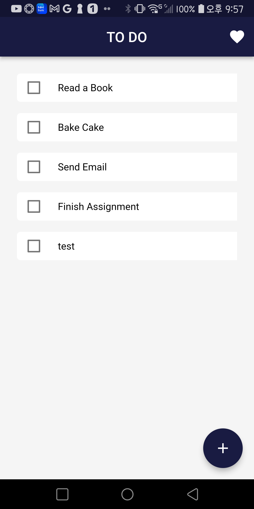
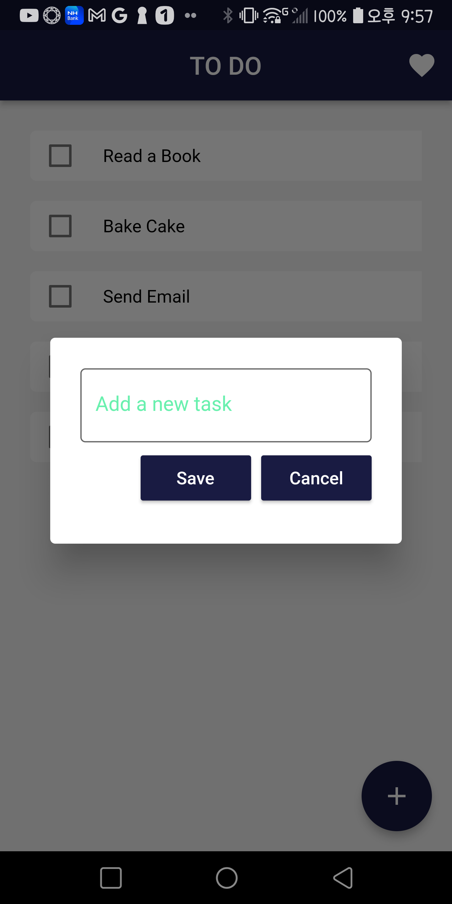
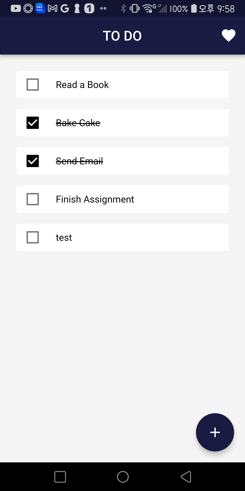

# 

## WHAT  TO  DO

설명: 간단한 투두 앱

제공기능:

* TASK 등록
  * 우측하단 플러팅버튼 클릭하여 등록
* TASK 삭제
  * TASK를 왼쪽으로 슬라이드하여 삭제
* TASK 순서 변경
  * TASK를 드래그하여 원하는 위치로 순서 변경
* COLOR 변경
  * 우측상단 ♡ 버튼 클릭하여 색 변경 (navy→pink→yellow→green→sky)

사용법 GIF:

몇가지 스크린샷

